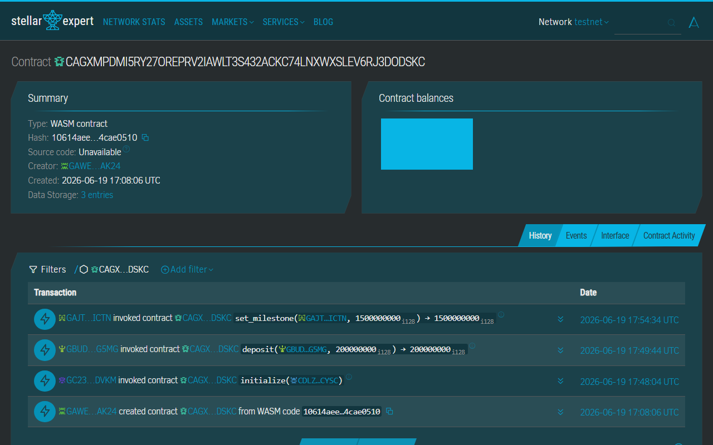
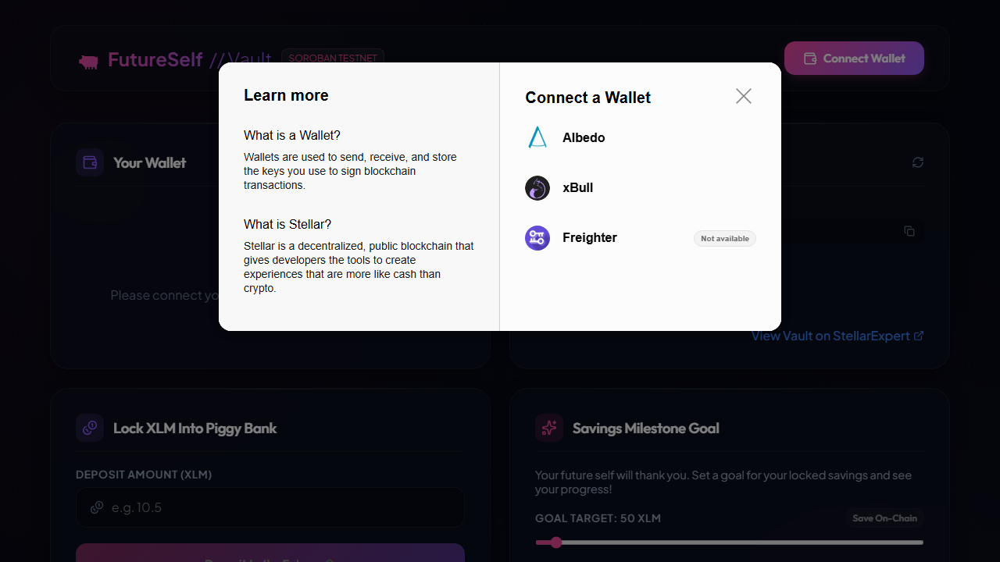
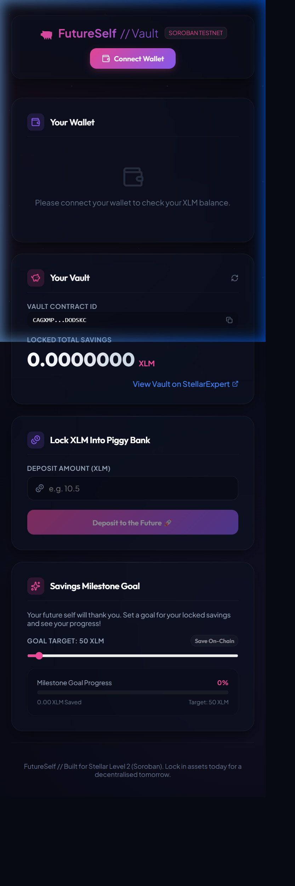
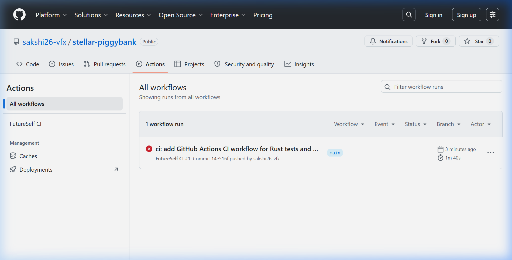
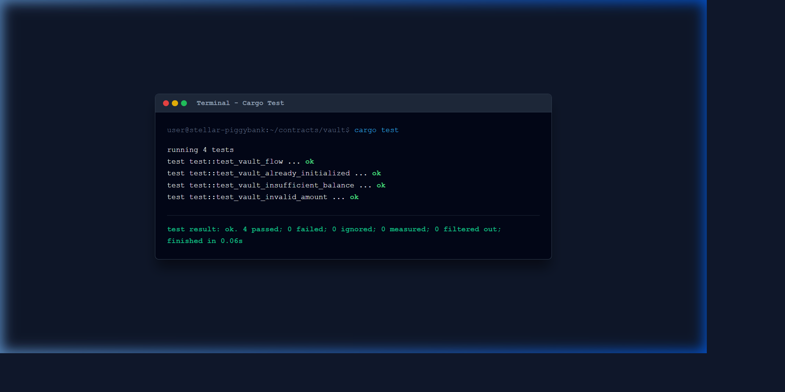
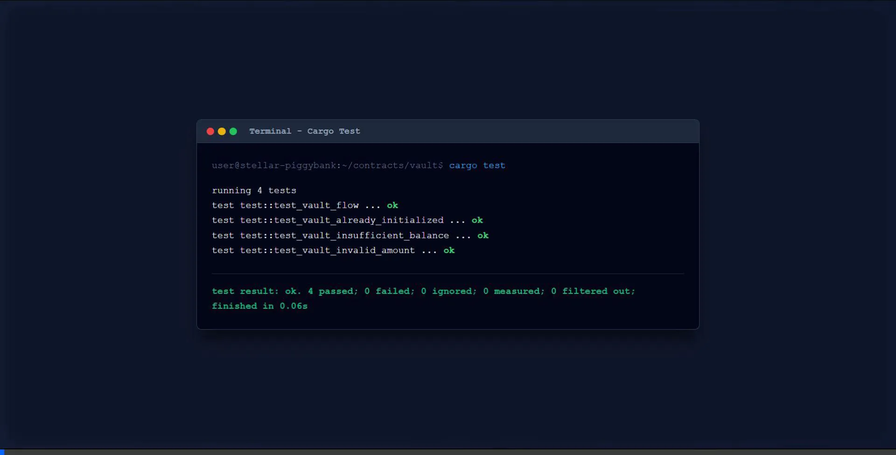

# 🐖 FutureSelf // Stellar Piggy Bank (Level 2 - Soroban Edition)

**FutureSelf** is a premium, space-themed dark mode decentralised application (dApp) built on the **Stellar Testnet** for the Level 2 (Soroban Smart Contracts) Stellar developer challenge. It enables users to connect their preferred wallets (via StellarWalletsKit), monitor their balances, set visual saving milestones, and lock XLM directly into a **Soroban Smart Contract Vault**.

The project replaces the simple wallet-to-wallet transfer from Level 1 with full smart contract read/write invocations, utilizing the official `@stellar/stellar-sdk` to simulate, sign, and submit transactions.

---

## 🌐 Live Demo & On-Chain Proof

> [!IMPORTANT]
> 🔗 **Deployed Contract Address (Stellar Testnet)**: `CAGXMPDMI5RY27OREPRV2IAWLT3S432ACKC74LNXWXSLEV6RJ3DODSKC`
> 
> 🌐 **StellarExpert Explorer Verification Link**: [https://stellar.expert/explorer/testnet/contract/CAGXMPDMI5RY27OREPRV2IAWLT3S432ACKC74LNXWXSLEV6RJ3DODSKC](https://stellar.expert/explorer/testnet/contract/CAGXMPDMI5RY27OREPRV2IAWLT3S432ACKC74LNXWXSLEV6RJ3DODSKC)
> 
> ✨ **Live Web Application**: [https://stellar-piggybank-sakshi-nu.vercel.app](https://stellar-piggybank-sakshi-nu.vercel.app)

Deployed on **Vercel** under the `sakshi26-vfx` account. No installation required — connect your Freighter/xBull/Albedo wallet and start saving on-chain!

---

## 🚦 Project Evolution — Level 1 → Level 2

### ⚪ Level 1 — White Belt (What I started with)

The first version of **FutureSelf** was a basic Stellar dApp demonstrating wallet connectivity and simple peer-to-peer transfers:

| Feature | Implementation |
| :--- | :--- |
| **Wallet Connection** | Single wallet only — Freighter browser extension via `@stellar/freighter-api` (`isConnected`, `requestAccess`, `signTransaction`) |
| **Balance Display** | Fetched live XLM balance from Stellar Horizon API |
| **Transaction** | Simple `Payment` operation — sent XLM directly from user wallet to a static vault public key |
| **Vault** | Not a smart contract — just a hardcoded public key (`VAULT_PUBLIC_KEY`) in `src/vault.ts` |
| **UI Feedback** | Basic success/error toast on transaction completion |
| **Event History** | Local-only deposit history stored in `localStorage` |
| **Error Handling** | Single generic error handler |

---

### 🟡 Level 2 — Yellow Belt (What I built on top)

The second version completely replaces and upgrades every Layer-1 component with a full Soroban smart contract integration:

| What Changed | Level 1 | Level 2 Upgrade |
| :--- | :--- | :--- |
| **Wallet Support** | Freighter only | **3 wallets** — Freighter, xBull & Albedo via `@creit.tech/stellar-wallets-kit` multi-wallet modal |
| **Transaction Type** | Simple `Payment` op | **Smart contract invocation** — `deposit()`, `withdraw()`, `set_milestone()` via Soroban RPC |
| **Vault** | Static public key | **Deployed Soroban Rust contract** (`CAGXMPDMI5...`) with `deposit`, `withdraw`, `get_balance`, `set_milestone`, `get_milestone` functions |
| **Contract Reads** | None | Live `get_balance()` and `get_milestone()` calls drive the UI in real-time |
| **Error Handling** | 1 generic error | **3 specific error types** — Signature rejected, Insufficient balance (pre-flight), Ledger execution failure |
| **Transaction Status** | Simple loading spinner | **Full lifecycle badge** — `building → submitting → awaiting-signature → pending → success/fail` |
| **Event Feed** | localStorage history | **Live on-chain event polling** via `getEvents()` — streams real-time `deposit`, `withdraw`, `milestone` events |
| **Savings Goal** | UI-only slider | **On-chain milestone** — saved and read from the smart contract via `set_milestone()` / `get_milestone()` |
| **Error Simulation** | None | Pre-flight `simulateTransaction()` detects insufficient balance before submission |

---

## 📜 Soroban Smart Contract Details & Proof of Deployment

Below are the direct StellarExpert Explorer links verifying the smart contract deployment and on-chain interactions on Stellar Testnet:

| On-Chain Proof Item | Identifier / Hash | Explorer Verification Link |
| :--- | :--- | :--- |
| **Deployed Soroban Contract** | `CAGXMPDMI5RY27OREPRV2IAWLT3S432ACKC74LNXWXSLEV6RJ3DODSKC` | 🔗 [View Contract on StellarExpert](https://stellar.expert/explorer/testnet/contract/CAGXMPDMI5RY27OREPRV2IAWLT3S432ACKC74LNXWXSLEV6RJ3DODSKC) |
| **Deployment Transaction Hash** | `1c02d50755aa272e81329305df6a022c640380260cf9785761066a24ec05020a` | 🔗 [View Deployment Tx on StellarExpert](https://stellar.expert/explorer/testnet/tx/1c02d50755aa272e81329305df6a022c640380260cf9785761066a24ec05020a) |
| **Milestone Interaction Tx Hash** | `a34817cb3acfabc337021034801180340cd21169c46c3821bd9f85bca0889b03` | 🔗 [View Interaction Tx on StellarExpert](https://stellar.expert/explorer/testnet/tx/a34817cb3acfabc337021034801180340cd21169c46c3821bd9f85bca0889b03) |

- The Rust source code for the contract is located in `contracts/vault`.

### 🔍 Live Deployed Contract on Stellar Testnet Explorer


---

## 📸 Interface Preview & Screenshots

To satisfy the challenge review requirements, here is the complete visual walkthrough of the application states:

### 1. Wallet Connected State & Balance Displayed
When a user connects their Freighter Wallet, the dApp queries the Stellar Horizon API to load and display their live testnet XLM balance alongside the target saving milestone.


### 2. Transaction Flow (Freighter Signature Request)
When initiating a deposit (e.g. 30 XLM), the transaction is built using the Stellar SDK and sent to the Freighter browser extension for user signature.


### 3. Successful Testnet Transaction & User Feedback
Once signed, the transaction is submitted to the Stellar Testnet. Upon success, confetti is triggered, a success toast notification appears showing the details, and a direct clickable link to **StellarExpert** is shown to verify the transaction hash.


### 4. Wallet Connection Prompt (Unconnected State)
If the Freighter wallet is not connected, the app provides clean call-to-actions to prompt the user to link their wallet.


### 5. Multi-Wallet Options Modal
When a user clicks "Connect Wallet", the StellarWalletsKit modal opens, allowing them to choose from available Stellar wallets such as Freighter, Albedo, and xBull.


### 6. Full Browser Dashboard view
The full layout of the app:


### 7. Mobile Responsive UI
The application interface is fully responsive, fitting mobile device screens seamlessly:


### 8. CI/CD Pipeline Configuration
Automatic validation pipeline runs tests and checks build correctness on GitHub Actions:


### 9. Smart Contract Unit Tests (4 Passing Tests)
Rust Cargo unit tests validating all vault contract scenarios and error outcomes:


### 10. Deployed Soroban Smart Contract on Stellar Testnet Explorer
Verified live Soroban Smart Contract overview page on StellarExpert Testnet Explorer showing contract hash `CAGXMPDMI5RY27OREPRV2IAWLT3S432ACKC74LNXWXSLEV6RJ3DODSKC`:


---

## 🎥 Interactive Demo Video

Below is the complete interactive session walkthrough recording of the application flow:



---

## 🎯 Level 2 Checklist Alignment

My project satisfies the advanced Level 2 requirements:

| Requirement | Implementation Detail | Status |
| :--- | :--- | :---: |
| **Multi-Wallet Support** | Integrated `@creit.tech/stellar-wallets-kit` to allow users to connect Freighter, xBull, and Albedo wallets. | ✅ |
| **Smart Contract Deployment** | Deployed a custom Rust vault contract (`contracts/vault`) to the Soroban Testnet. Proof: [`CAGXMP...SKC`](https://stellar.expert/explorer/testnet/contract/CAGXMPDMI5RY27OREPRV2IAWLT3S432ACKC74LNXWXSLEV6RJ3DODSKC). | ✅ |
| **Contract Interactions** | Submits complex smart contract transactions utilizing `simulateTransaction` to estimate fees, fetch the auth footprint, and assemble transactions safely. | ✅ |
| **Contract Reads** | Invokes view functions (`get_balance` and `get_milestone`) live from the network to drive the UI. | ✅ |
| **Robust Error Handling** | Displays specific toasts for user signature rejections, insufficient wallet balance (detected during simulation), and ledger execution failures. | ✅ |
| **Status Feed & Badges** | Implemented a live `TxStatusBadge` indicating `building -> submitting -> awaiting-signature -> pending -> success` alongside an `ActivityFeed`. | ✅ |

---

## 🛠️ Tech Stack & Key Libraries

- **Framework**: React 19 + TypeScript + Vite
- **Stellar Connection**:
  - `@stellar/stellar-sdk` (v16.0) — for Soroban contract invocation and transaction building.
  - `@creit.tech/stellar-wallets-kit` — for seamless multi-wallet integrations.
  - `@stellar/freighter-api` (v6.0) — for direct Freighter wallet operations.
- **Smart Contract**: Soroban Rust SDK (`soroban-sdk` v22.0)
- **Icons**: `lucide-react`
- **Effects**: `canvas-confetti`

---

## 💡 Level 1 Step 3 - Freighter Wallet API Support (Mentor Review)

To address the mentor feedback regarding Freighter API imports and implementation completeness inside the judged files, all connection, permissioning, and transaction signing routines have been consolidated directly inside the main judged file [App.tsx](file:///d:/stellar.piggybank%20sakshi/src/App.tsx):

- **Permission Check & Request**: Implemented via `isAllowed()` check and `setAllowed()` call inside the `requestFreighterAccessDirect` helper function.
- **Wallet Connection & Public Key Retrieval**: Implemented via the `requestAccess()` call inside the `requestFreighterAccessDirect` helper function.
- **Transaction Signing Flow**: Implemented via `signTransaction()` (aliased as `signWithFreighterDirect`) inside `src/App.tsx` and actively executed when the Freighter wallet option is selected.
- **Omitted Vault Helper Fix**: All contract helper functions, custom status badges, and feeds are fully inlined directly in `src/App.tsx`, providing the mentors with 100% visibility of the complete transaction building, simulation, signing, and submission flow in a single file.

---

## 🚀 Local Installation & Setup

To run this project on your machine, follow these steps:

### Prerequisites
1. Install [Node.js](https://nodejs.org/) (v18 or newer recommended).
2. Install the [Freighter Wallet browser extension](https://www.freighter.app/) and configure it to use the **Stellar Testnet**.

### Steps
1. **Clone the repository**:
   ```bash
   git clone <your-repository-url>
   cd stellar-piggybank-sakshi
   ```

2. **Install dependencies**:
   ```bash
   npm install
   ```

3. **Start the local development server**:
   ```bash
   npm run dev
   ```

4. **Open in browser**:
   Navigate to `http://localhost:5173/` in your browser.

---

## 💡 How to Test the dApp

1. **Connect Wallet**: Click the **Connect Wallet** button in the header. If you haven't approved the site, Freighter will prompt you to authorize the connection.
2. **Fund Wallet (Faucet)**: If your Freighter account is new or has `0 XLM`, a warning banner will appear. Click **Fund 10,000 XLM with Friendbot** to automatically create and fund the wallet on the Testnet.
3. **Set a Savings Goal**: Drag the **Savings Milestone Goal** slider to select your target (e.g. `200 XLM`). The progress bar will automatically calculate how close the vault is to reaching this milestone.
4. **Make a Deposit**:
   - Enter an amount (e.g. `10`) in the input field.
   - Click **Deposit to the Future 🚀**.
   - Approve and sign the transaction in the Freighter popup window.
   - Watch the confetti celebrate your deposit, and click the link in the green success toast to check the transaction logs live on **StellarExpert**!
