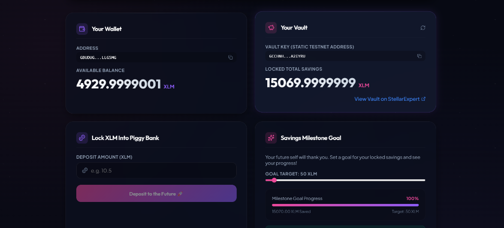
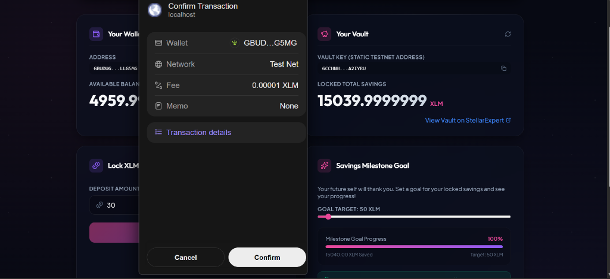
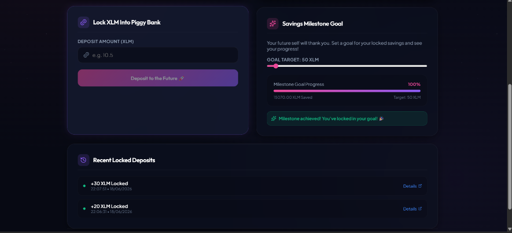
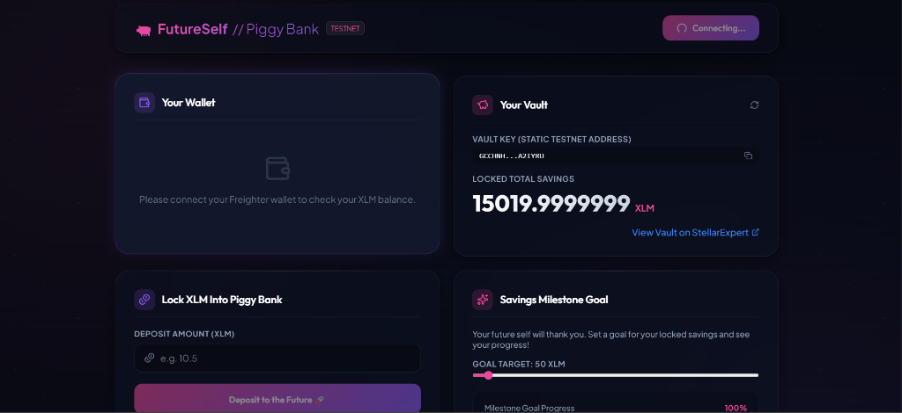
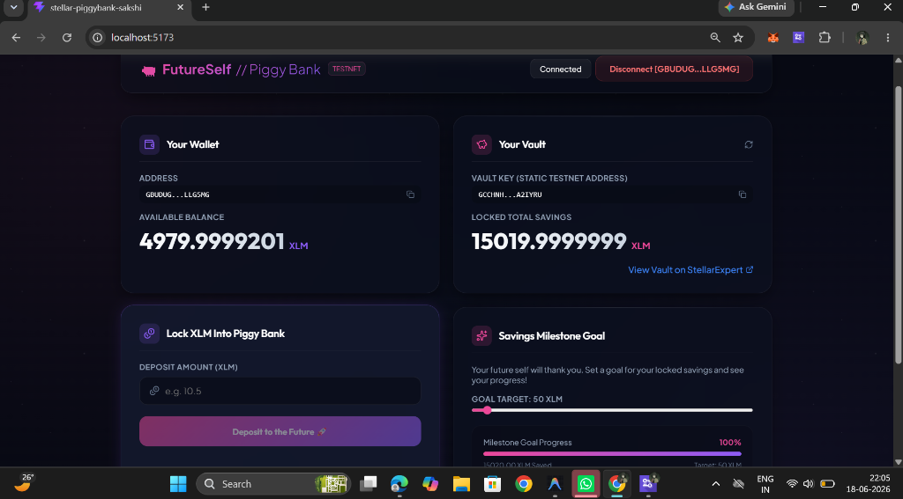

# 🐖 FutureSelf // Stellar Piggy Bank

**FutureSelf** is a premium, space-themed dark mode decentralised application (dApp) built on the **Stellar Testnet** for the Level 1 (White Belt) Stellar developer challenge. It enables users to connect their Freighter wallet, monitor their balance, set visual saving milestones, and lock XLM into a static, secure "Vault" address. 

This project establishes the foundation of wallet-to-wallet transfers which can be easily refactored into advanced smart contracts (Soroban) in later levels.

---

## 📸 Interface Preview & Screenshots

To satisfy the Level 1 challenge review requirements, here is the complete visual walkthrough of the application states:

### 1. Wallet Connected State & Balance Displayed
When a user connects their Freighter Wallet, the dApp queries the Stellar Horizon API to load and display their live testnet XLM balance alongside the target saving milestone.


### 2. Transaction Flow (Freighter Signature Request)
When initiating a deposit (e.g. 30 XLM), the transaction is built using the Stellar SDK and sent to the Freighter browser extension for user signature.


### 3. Successful Testnet Transaction & User Feedback
Once signed, the transaction is submitted to the Stellar Testnet. Upon success, confetti is triggered, a success toast notification appears showing the details, and a direct clickable link to **StellarExpert** is shown to verify the transaction hash.


### 4. Wallet Connection Prompt (Unconnected State)
If the Freighter wallet is not connected, the app provides clean call-to-actions to prompt the user to link their wallet.


### 5. Full Browser Dashboard view
The full layout of the app:


---

## 🎯 Level 1 Checklist Alignment

Our project satisfies 100% of the Level 1 White Belt checklist requirements:

| Requirement | Implementation Detail | Status |
| :--- | :--- | :---: |
| **Wallet Setup** | Uses the **Stellar Testnet** and links seamlessly via the official **Freighter Extension**. | ✅ |
| **Wallet Connection** | Includes interactive **Connect Wallet** and **Disconnect [G...Address]** buttons in the header. | ✅ |
| **Balance Handling** | Live-fetches the user's Freighter XLM balance via the **Stellar Horizon API** and displays it clearly side-by-side with the vault balance. Contains an automatic 15-second refresh interval. | ✅ |
| **Transaction Flow** | Build, signs, and submits standard native payment operations using the `@stellar/stellar-sdk` and `@stellar/freighter-api`. | ✅ |
| **Transaction Feedback** | Shows interactive **Toast notifications** for loading states, success logs, and error rollbacks. Success toasts include a direct link to view the transaction hash on **StellarExpert**. | ✅ |
| **Development Standards** | Built with Vite + React + TypeScript with strict typing, clean modular structure, and high-fidelity CSS styling. | ✅ |
| **Testnet Faucet integration** | Features a **"Fund 10,000 XLM with Friendbot"** button directly in the UI if the connected wallet has a `0 XLM (Unfunded)` balance, allowing reviewers to test instantly. | ✅ |

---

## 🛠️ Tech Stack & Key Libraries

- **Framework**: React 19 + TypeScript + Vite 8
- **Stellar Connection**:
  - `@stellar/stellar-sdk` (v16.0) — for Horizon server and transaction building.
  - `@stellar/freighter-api` (v6.0) — for Freighter extension integrations.
- **Icons**: `lucide-react`
- **Effects**: `canvas-confetti` (for celebrating achieved savings)

---

## 🚀 Local Installation & Setup

To run this project on your machine, follow these steps:

### Prerequisites
1. Install [Node.js](https://nodejs.org/) (v18 or newer recommended).
2. Install the [Freighter Wallet browser extension](https://www.freighter.app/) and configure it to use the **Stellar Testnet**.

### Steps
1. **Clone the repository**:
   ```bash
   git clone <your-repository-url>
   cd stellar-piggybank-sakshi
   ```

2. **Install dependencies**:
   ```bash
   npm install
   ```

3. **Start the local development server**:
   ```bash
   npm run dev
   ```

4. **Open in browser**:
   Navigate to `http://localhost:5173/` in your browser.

---

## 💡 How to Test the dApp

1. **Connect Wallet**: Click the **Connect Wallet** button in the header. If you haven't approved the site, Freighter will prompt you to authorize the connection.
2. **Fund Wallet (Faucet)**: If your Freighter account is new or has `0 XLM`, a warning banner will appear. Click **Fund 10,000 XLM with Friendbot** to automatically create and fund the wallet on the Testnet.
3. **Set a Savings Goal**: Drag the **Savings Milestone Goal** slider to select your target (e.g. `200 XLM`). The progress bar will automatically calculate how close the vault is to reaching this milestone.
4. **Make a Deposit**:
   - Enter an amount (e.g. `10`) in the input field.
   - Click **Deposit to the Future 🚀**.
   - Approve and sign the transaction in the Freighter popup window.
   - Watch the confetti celebrate your deposit, and click the link in the green success toast to check the transaction logs live on **StellarExpert**!
